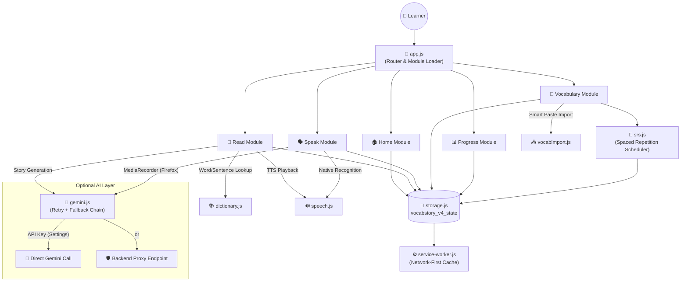

<div align="center">

```
██╗   ██╗ ██████╗  ██████╗ █████╗ ██████╗ 
██║   ██║██╔═══██╗██╔════╝██╔══██╗██╔══██╗
██║   ██║██║   ██║██║     ███████║██████╔╝
╚██╗ ██╔╝██║   ██║██║     ██╔══██║██╔══██╗
 ╚████╔╝ ╚██████╔╝╚██████╗██║  ██║██████╔╝
  ╚═══╝   ╚═════╝  ╚═════╝╚═╝  ╚═╝╚═════╝ 

███████╗████████╗ ██████╗ ██████╗ ██╗   ██╗
██╔════╝╚══██╔══╝██╔═══██╗██╔══██╗╚██╗ ██╔╝
███████╗   ██║   ██║   ██║██████╔╝ ╚████╔╝ 
╚════██║   ██║   ██║   ██║██╔══██╗  ╚██╔╝  
███████║   ██║   ╚██████╔╝██║  ██║   ██║   
╚══════╝   ╚═╝    ╚═════╝ ╚═╝  ╚═╝   ╚═╝   
```

# VocabStory V4.1

**A modular, GitHub Pages-ready English learning application built around one core loop**

### Read → Understand → Speak → Review → Remember

[](#project-structure)
[](#app--platform-layer)
[](#gemini-configuration)
[](#github-pages-deployment)
[](#)

</div>

---

## Table of Contents

- [Overview](#overview)
- [System Architecture & Data Flow](#system-architecture--data-flow)
- [Feature Modules](#feature-modules)
  - [Home](#-home)
  - [Read](#-read)
  - [Speak](#-speak)
  - [Vocabulary](#-vocabulary)
  - [Progress](#-progress)
  - [App / Platform Layer](#-app--platform-layer)
- [Project Structure](#project-structure)
- [Local Development](#local-development)
- [GitHub Pages Deployment](#github-pages-deployment)
- [Gemini Configuration](#gemini-configuration)
- [Legacy (V3 → V4) Migration](#legacy-v3--v4-migration)
- [Firefox Speech Fallback](#firefox-speech-fallback)
- [Security Considerations](#security-considerations)
- [Roadmap](#roadmap)

---

## Overview

**VocabStory** is a browser-based English learning application designed around a single, repeatable learning loop: a learner reads graded content, looks up and internalizes new vocabulary in context, practices speaking it aloud, and reviews it over time through spaced repetition until it is retained long-term.

Version **4.1** preserves the modular, dependency-light architecture introduced in V4 — built entirely on native ES modules, with no build step required — while expanding the reading engine, the vocabulary workspace, the quiz system, and Firefox/Floorp speech support.

The application is designed to run as a fully static site (ideal for **GitHub Pages**), with all AI functionality (Gemini-based translation, story generation, and speech evaluation) treated as an optional, user-configured enhancement rather than a hard dependency.

---

## System Architecture & Data Flow



**Data flow summary:**
`Learner Interaction` → `Router (app.js)` → `Feature Module` → `Service Layer (dictionary / speech / gemini / srs)` → `storage.js (localStorage: vocabstory_v4_state)` → `Service Worker (offline cache & PWA shell)`

> Note: All learner data — vocabulary pool, SRS state, saved sentences, activity history — is persisted client-side. No backend database is required unless the optional proxy endpoint is configured for Gemini calls.

---

## Feature Modules

### 🏠 Home

- Daily goal tracking and streak counter
- "Continue reading" shortcut to the last active chapter
- Due SRS reviews surfaced at a glance
- Weekly activity overview
- Recently learned vocabulary

### 📖 Read

- Built-in graded stories across CEFR levels **A1**, **A2**, and **B1**
- Chapter vocabulary preview with color-coded learning / review / mastered status
- Full, searchable, de-duplicated chapter word list
- Click-to-fetch contextual lookup: Turkish meaning, IPA transcription, and English definition (cached after first fetch)
- Batch **"Prepare all Turkish meanings"** action for an entire chapter
- Multi-word phrase recognition (e.g. `pick up`, `instead of`)
- Dedicated word/phrase learning panel: IPA, English definition, Turkish contextual meaning, and example sentence
- Sentence-level Turkish translation
- Sentence-level and full-chapter text-to-speech
- "Save sentence" for later review
- Chapter comprehension quizzes
- **Vocabulary Lab** — Turkish meaning, English definition, and fill-the-gap exercises
- Grammar Discovery cards
- AI-assisted feedback on user retellings
- Focus mode and Learning mode reading layouts
- Live reading progress and word-count tracking
- AI-generated graded stories built from the learner's own vocabulary pool

### 🗣️ Speak

- Scenario-based practice: airport, café, hotel, and workplace
- Text-to-speech shadowing exercises
- Native browser speech recognition where supported (Chromium-based browsers)
- **Firefox / Floorp fallback:** `MediaRecorder` capture → Gemini audio evaluation
- Approximate sentence similarity scoring
- Gemini-generated roleplay dialogue with automatic model fallback

### 🧠 Vocabulary

- Full spaced-repetition (SRS) review queue
- Again / Hard / Good / Easy review actions
- Search plus All / Learning / Review / Mastered filters
- Full-row color coding by learning status
- Bulk word selection
- Study the selected or currently filtered list as flashcards
- Copy the selected or currently filtered list to clipboard
- Send selected or due-for-review words directly into the AI story builder
- **Quizlet-style smart paste importer**, supporting:
  - `word - meaning` format
  - Tab-separated values
  - Alternating word/meaning lines
  - Automatic stripping of copied UI noise (`star filled`, `sound`, `edit`, etc.)
- Saved sentence library

### 📊 Progress

- Total words read
- Mastered vocabulary count
- Quiz accuracy
- Speaking average score
- Weekly activity chart
- Per-book reading progress
- Milestone tracking

### ⚙️ App / Platform Layer

- Modular, dependency-free ES modules (no bundler required)
- Light / dark theme support
- Full PWA shell with service worker (installable, offline-capable)
- Mobile-first bottom navigation
- Automatic migration of legacy V3 vocabulary, API key, and activity data
- Gemini retry and multi-model fallback chain
- Optional backend proxy endpoint for production-safe API key handling

---

## Project Structure

```text
vocab-story-v4/
├─ index.html
├─ favicon.svg
├─ manifest.webmanifest
├─ service-worker.js
├─ README.md
├─ CHANGELOG.md
├─ css/
│  ├─ tokens.css
│  ├─ app.css
│  ├─ reader.css
│  └─ responsive.css
└─ js/
   ├─ app.js                  # Router & module orchestration
   ├─ config.js                # App-wide configuration (default AI model, etc.)
   ├─ router.js
   ├─ data/
   │  └─ books.js              # Built-in graded story catalog
   ├─ modules/
   │  ├─ home.js
   │  ├─ read.js
   │  ├─ speak.js
   │  ├─ vocabulary.js
   │  ├─ vocabImport.js
   │  └─ progress.js
   ├─ services/
   │  ├─ gemini.js              # AI calls, retry/fallback chain
   │  ├─ speech.js               # TTS + speech recognition
   │  ├─ dictionary.js           # Word/sentence lookup & caching
   │  ├─ srs.js                  # Spaced repetition scheduler
   │  └─ storage.js              # Local persistence layer
   └─ ui/
      ├─ icons.js
      ├─ toast.js
      └─ wordModal.js
```

---

## Local Development

ES modules must be served over HTTP — opening `index.html` directly via `file://` will not work due to browser module-loading restrictions.

```bash
cd vocab-story-v4.1
python -m http.server 8080
```

Then open:

```text
http://localhost:8080
```

On Windows, you can alternatively double-click `start.bat`.

---

## GitHub Pages Deployment

1. Upload the **contents** of `vocab-story-v4.1/` (not the folder itself) to the repository or branch configured for GitHub Pages.
2. All asset paths are relative, so project-page URLs of the form:

   ```text
   https://USERNAME.github.io/vocab-story/
   ```

   are fully supported without additional path configuration.

3. If replacing an older VocabStory deployment, perform **one hard refresh** (`Ctrl + Shift + R`). The V4 service worker uses a network-first caching strategy and will refresh its cache automatically as new files are requested.

---

## Gemini Configuration

The default preferred model is defined centrally in:

```js
// js/config.js
preferredModel: 'gemini-3.8-flash'
```

Retry and fallback behavior across multiple models is implemented in `js/services/gemini.js`.

Two configuration paths are supported:

| Option | Description |
|---|---|
| **1. Direct API key** | Set under **Settings → AI**. Simplest setup; suitable for personal/local use. |
| **2. Backend proxy endpoint** | Recommended for public deployments — keeps the provider API key server-side. |

---

## Legacy (V3 → V4) Migration

On first launch, V4 automatically detects and migrates the following legacy V3 browser values:

- `vocab_pool`
- `gemini_api_key`
- `gemini_model`
- `vocabstory_activity`

V4 itself stores all application state under a single key:

```text
vocabstory_v4_state
```

---

## Firefox Speech Fallback

Firefox does not expose the same native `SpeechRecognition` API path used by Chromium-based browsers. To keep the Speak module functional across browsers, V4.1 records a short microphone clip using `MediaRecorder` and sends it to Gemini for transcription and pronunciation matching — provided AI settings have been configured. Text-to-speech playback continues to use the browser's native `speechSynthesis` engine in all supported browsers.

---

## Security Considerations

A Gemini API key configured directly on a static GitHub Pages deployment is visible to any user via browser DevTools / Network inspection. For public production deployments, use the **backend proxy** configuration option and keep the provider API key server-side rather than embedding it client-side.

---

## Roadmap

- [ ] Public-domain book catalog stored as separate JSON files
- [ ] Streaming audiobook playback with synchronized word highlighting
- [ ] Per-user cloud accounts with cross-device sync
- [ ] Production-grade server-side Gemini proxy
- [ ] AI tutor for selected sentences and grammar questions
- [ ] Richer SRS scheduling with full learning history
- [ ] Book search, tagging, and downloadable offline content packs

---

<div align="center">

**VocabStory V4.1** — Read → Understand → Speak → Review → Remember

</div>
